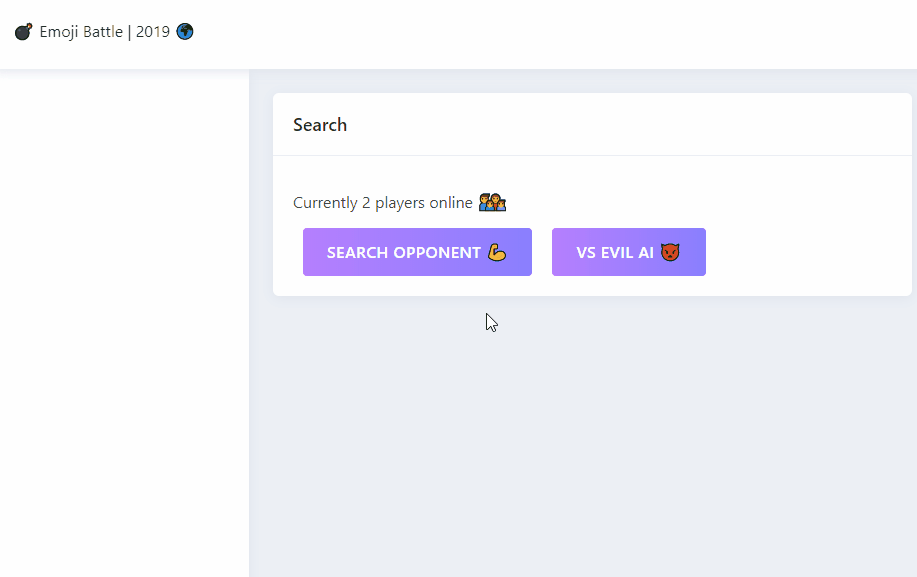
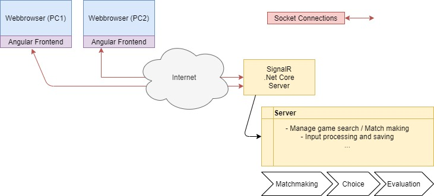

# Emoji Battle | Angular 8 + SignalR (.NET Core)

Emoji Battle is a Webbased realtime **Rock Paper Scissors** ➡️ "👻🤖👽" game where you can play versus a random opponent or versus a random AI.

## Rules Of The Game

The rules are simple:

👻 beats 👽

👽 beats 🤖

🤖 beats 👻

If both players choose the same the game will be replayed.

# [Try it 🕹️](http://134.209.229.170)



## Interesting bits for developers

Since this project makes use of SignalR which is Socket based, this game is played in "real time" against eighter a other human or the AI. Read more about Socket connections [here](https://de.wikipedia.org/wiki/Socket_(Software)). This game has a searching feature where the players are added to a searching que on the server. Also it shows the live count of players at the current moment.

#####Architecture Diagram:


## What was used?

Angular 7 and [Nebular](https://github.com/akveo/nebular) for the frontend & Asp.NET Core and SignalR for the backend.

### Prerequisites

Required:
- latest [Angular CLI](https://cli.angular.io/)
- [.Net Core 3.1](https://dotnet.microsoft.com/download/dotnet-core/3.1)

Optional:
- Editor ([VSCode](https://code.visualstudio.com/) is recommended)


### Getting Started

To install this project on your own maschine for further development you can simply clone this repository and follow these steps:

**Rebuild & run the Server:**

```
> cd backend
> dotnet restore
> dotnet run
```

**Install dependencys and run the Client:**

```
> cd client
> npm i
> ng build --watch
```

The client will automaticaly build to the **/wwwroot** folder of the backend which is served by the Asp.NET Core Server usualy under the port 5000

## Get Involved

I would love to see modifications or additions to this project, in case you have any questions just contact me [here](https://dennisrauscher.de/).

## Authors

* **Dennis Rauscher** - *Initial work* - [GitHub](https://github.com/DennisRauscher)

## License

This project is licensed under the MIT License - see the [LICENSE.md](LICENSE.md) file for details
